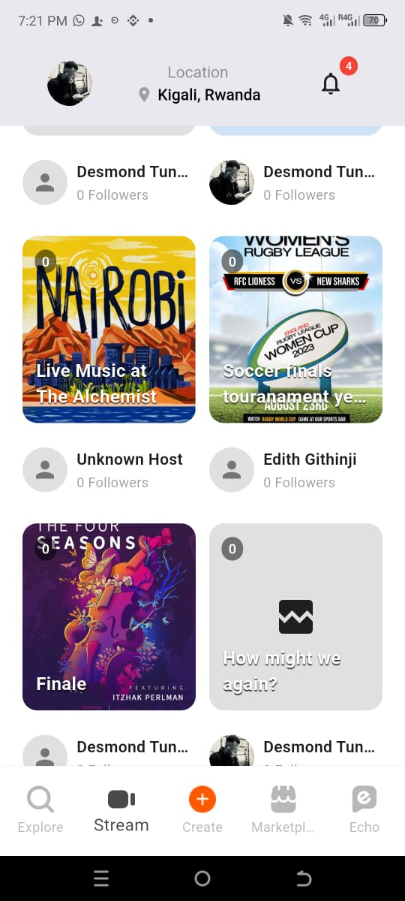

# Rovify

A modern Flutter application for discovering and creating events, with NFT marketplace integration and social features. Rovify uses Google Firestore NoSQL database to power NFT-ticketed events with real-time interactions and community governance.

## Overview

Rovify is a comprehensive event discovery and creation platform that allows users to:
- **Discover Events**: Browse and search for upcoming events in your area
- **Create Events**: Organize and manage your own events
- **NFT Marketplace**: Trade and collect event-related NFTs
- **Social Features**: Connect with other users and creators
- **Location Services**: Find events near you with location-based recommendations
- **Wallet Integration**: Connect various crypto wallets (MetaMask, Coinbase, etc.)

## Project Structure

```
rovify/
├── lib/
│   ├── core/                    # Core utilities and constants
│   │   ├── constants/           # App constants and configurations
│   │   └── theme/               # App theming and styling
│   │   └── utils/               # For simple validations
│   │   └── widgets/             # Custom button and responsive builder
│   ├── data/                    # Data layer
│   │   ├── datasources/         # Remote and local data sources
│   │   ├── firebase/            # Firebase configuration
│   │   ├── models/              # Data models
│   │   └── repositories/        # Repository implementations
│   ├── domain/                  # Business logic layer
│   │   ├── entities/            # Domain entities
│   │   ├── repositories/        # Repository interfaces
│   │   └── usecases/            # Business use cases
│   ├── presentation/            # UI layer
│   │   ├── blocs/               # BLoC state management
│   │   │   ├── auth/            # Authentication BLoC
│   │   │   ├── event/           # Event management BLoC
│   │   │   ├── nft/             # NFT marketplace BLoC   
│   │   │   └── onboarding/      # Onboarding flow BLoC
│   │   ├── common/              # Reusable UI components
│   │   ├── routes/              # App routing configuration
│   │   └── screens/             # App screens
│   │       ├── auth/            # Authentication screens
│   │       ├── home/            # Main app screens
|   |       |       ├── pages/           # Pages screens
|   |       |       ├── tabs/            # Tabs for Navigation
|   |       |       └── widgets/         # Different implementations for various tabs
|   |       |                  ├── create           # Create event implementation
|   |       |                  ├── creator          # Creator implementation
|   |       |                  ├── explore          # Explore implementation
|   |       |                  └── stream           # Stream implementation
│   │       ├── onboarding/      # Onboarding flow
│   │       └── splash/          # Splash screen
│   └── main.dart                # App entry point
├── assets/                      # App assets
│   ├── icons/                   # App icons
│   ├── onboarding-images/       # Onboarding assets
│   ├── marketplace-images/      # Marketplace assets
│   ├── splash-images/           # Splash screen assets
│   ├── stack-images/            # Stack navigation assets
│   └── tab-images/              # Tab navigation assets
└── test/                        # Unit and widget tests

```

## Features

### Core Features
- **Event Discovery**: Browse events by category, location, and date
- **Event Creation**: Create and manage events with rich details
- **User Authentication**: Secure login with Firebase Auth
- **Profile Management**: User profiles with customizable settings
- **Location Services**: GPS-based event discovery
- **Push Notifications**: Real-time event updates

### Advanced Features
- **NFT Marketplace**: Trade event-related digital collectibles
- **Wallet Integration**: Support for multiple crypto wallets
- **Social Features**: User connections and event sharing
- **Dark Mode**: Theme customization
- **Offline Support**: Cached data for offline browsing

## Technology Stack

### Frontend
- **Flutter**: Cross-platform UI framework
- **Dart**: Programming language
- **Material Design**: UI/UX design system

### State Management
- **BLoC Pattern**: Business Logic Component for state management
- **flutter_bloc**: BLoC implementation library
- **equatable**: Value equality for Dart objects

### Backend & Services
- **Firebase Auth**: User authentication
- **Cloud Firestore**: NoSQL database
- **Firebase Storage**: File storage
- **Google Sign-In**: Social authentication

### Additional Libraries
- **go_router**: Declarative routing
- **geolocator**: Location services
- **image_picker**: Image selection
- **shared_preferences**: Local data persistence
- **url_launcher**: External link handling


## Database Architecture

### **users**
User profiles with wallet integration
- `displayName`, `email`, `avatarUrl`, `interests[]`, `walletAddress`, `isCreator`, `joinedAt`

### **events** 
Event metadata for virtual/in-person experiences
- `title`, `hostID`, `type`, `location`, `category`, `datetime`, `description`, `status`, `thumbnailUrl`, `ticketType`, `createdAt`

### **tickets**
NFT ticket management with blockchain data
- `eventID`, `userID`, `walletAddress`, `qrCodeUrl`, `metadata{}`, `checkedIn`, `issuedAt`

### **creators**
Extended creator profiles and social links
- `bio`, `socials{}`, `eventsHosted[]`, `walletConnected`

### **notifications** *(New)*
User notifications and platform communications
- `userID`, `type`, `title`, `message`, `read`, `relatedEventID`, `createdAt`

## Planned Collections

- **eventRooms**: Real-time chat, polls, and participant tracking
- **memoryReels**: AI-generated post-event video highlights 
- **daoProposals**: Community governance and funding decisions
- **liveStreams**: Streaming data and viewer engagement (subcollection under events)

## Key Features
- **Blockchain Integration**: NFT tickets with IPFS metadata storage
- **Real-time Sync**: Live event updates and notifications
- **Scalable Design**: Document-based structure for horizontal scaling
- **Security**: User-based permissions with wallet verification

## Prerequisites

Before running this project, make sure you have:

- **Flutter SDK**: Version 3.8.1 or higher
- **Dart SDK**: Version 3.8.1 or higher
- **Android Studio** / **VS Code**: IDE with Flutter extensions
- **Firebase Project**: Configured Firebase project
- **Git**: Version control system

## Installation

### 1. Clone the Repository
```bash
git clone https://github.com/yourusername/rovify.git
cd rovify
```

### 2. Install Dependencies
```bash
flutter pub get
```

### 3. Firebase Configuration

#### Android Setup
1. Download `google-services.json` from Firebase Console
2. Place it in `android/app/`
3. Ensure Firebase project is configured for Android

#### iOS Setup
1. Download `GoogleService-Info.plist` from Firebase Console
2. Place it in `ios/Runner/`
3. Ensure Firebase project is configured for iOS

### 4. Environment Configuration
Create a `.env` file in the root directory (if needed):
```env
FIREBASE_PROJECT_ID=your-project-id
FIREBASE_API_KEY=your-api-key
```

## Running the App

### Development Mode
```bash
# Run on connected device/emulator
flutter run

# Run with specific device
flutter run -d <device-id>

# Run in release mode
flutter run --release
```

### Building for Production

#### Android
```bash
# Build APK
flutter build apk --release

# Build App Bundle
flutter build appbundle --release
```

#### iOS
```bash
# Build for iOS
flutter build ios --release
```

## Testing

### Run All Tests
```bash
flutter test
```

### Run Specific Test Files
```bash
# Run widget tests
flutter test test/

# Run specific test file
flutter test test/widget_test.dart
```

### Test Coverage
```bash
flutter test --coverage
```

## App Screenshots

### Animated Splash Screen
<table>
  <tr>
    <td></td>
    <td></td>
    <td></td>
  </tr>
  <tr>
    <td align="center">Welcome splash screen</td>
    <td align="center">Second splash screen</td>
    <td align="center">Third splash screen</td>
  </tr>
</table>

### Authentication Screens
<table>
  <tr>
    <td></td>
    <td></td>
    <td></td>
  </tr>
  <tr>
    <td align="center">Signup Screen</td>
    <td align="center">Login Screen</td>
    <td align="center">Forgot Password Screen</td>
  </tr>
</table>

### Onboarding Screens
<table>
  <tr>
    <td></td>
    <td></td>
    <td></td>
  </tr>
  <tr>
    <td align="center">Onboarding First Screen</td>
    <td align="center">Onboarding Second Screen</td>
    <td align="center">Onboarding Third Screen</td>
  </tr>
</table>

<table>
  <tr>
    <td></td>
    <td></td>
    <td></td>
  </tr>
  <tr>
    <td align="center">Onboarding Fourth Screen</td>
    <td align="center">Onboarding Fifth Screen</td>
    <td align="center">Onboarding Sixth Screen</td>
  </tr>
</table>

### Home Screens
<table>
  <tr>
    <td></td>
    <td></td>
    <td></td>
  </tr>
  <tr>
    <td align="center">Explore Home Screen</td>
    <td align="center">Stream Home Screen</td>
    <td align="center">Create Home Screen</td>
  </tr>
</table>

<table>
  <tr>
    <td></td>
    <td></td>
    <td></td>
  </tr>
  <tr>
    <td align="center">Marketplace Home Screen</td>
    <td align="center">Echo Home Screen</td>
    <td align="center">Profile Drawer Screen</td>
  </tr>
</table>

### Creator Dashboard Screens
<table>
  <tr>
    <td></td>
    <td></td>
    <td></td>
  </tr>
  <tr>
    <td align="center">Create New Event</td>
    <td align="center">Event Overview</td>
    <td align="center">My Events</td>
  </tr>
</table>

<table>
  <tr>
    <td></td>
    <td></td>
    <td></td>
  </tr>
  <tr>
    <td align="center">Event Details</td>
    <td align="center">Edit Event</td>
    <td align="center">Scan Tickets</td>
  </tr>
</table>

### User Event Booking and Host Check-in Processes
<table>
  <tr>
    <td></td>
    <td></td>
    <td></td>
  </tr>
  <tr>
    <td align="center">Book Event</td>
    <td align="center">Confirmation Screen</td>
    <td align="center">Notifications</td>
  </tr>
</table>

<table>
  <tr>
    <td></td>
    <td></td>
    <td></td>
  </tr>
  <tr>
    <td align="center">My Tickets</td>
    <td align="center">Ticket Details - Unchecked</td>
    <td align="center">Host Scans Ticket</td>
  </tr>
</table>

<table>
  <tr>
    <td></td>
    <td></td>
    <td></td>
  </tr>
  <tr>
    <td align="center">Scan Ticket Success</td>
    <td align="center">Ticket Checked In</td>
    <td align="center">Checked in Ticket Details</td>
  </tr>
</table>

## Configuration

### Firebase Setup
1. Create a new Firebase project
2. Enable Authentication (Email/Password, Google Sign-In)
3. Enable Cloud Firestore
4. Enable Firebase Storage
5. Configure security rules for Firestore and Storage

### Location Services
The app requires location permissions for event discovery:
- **Android**: Add location permissions to `android/app/src/main/AndroidManifest.xml`
- **iOS**: Add location usage descriptions to `ios/Runner/Info.plist`

## Contributing

1. Fork the repository
2. Create a feature branch (`git checkout -b feature/amazing-feature`)
3. Commit your changes (`git commit -m 'Add amazing feature'`)
4. Push to the branch (`git push origin feature/amazing-feature`)
5. Open a Pull Request


If you encounter any issues:

1. Check the [Issues](https://github.com/Darlington6/rovify/issues) page
2. Create a new issue with detailed information
3. Include device information, Flutter version, and error logs

## Links

- **Flutter Documentation**: https://docs.flutter.dev/
- **Firebase Documentation**: https://firebase.google.com/docs
- **BLoC Documentation**: https://bloclibrary.dev/

## Project Status

- ✅ Authentication System
- ✅ Event Management
- ✅ Location Services
- ✅ NFT Marketplace
- ✅ User Profiles
- ✅ Push Notifications
- 🔄 Advanced Search (Planned)

---